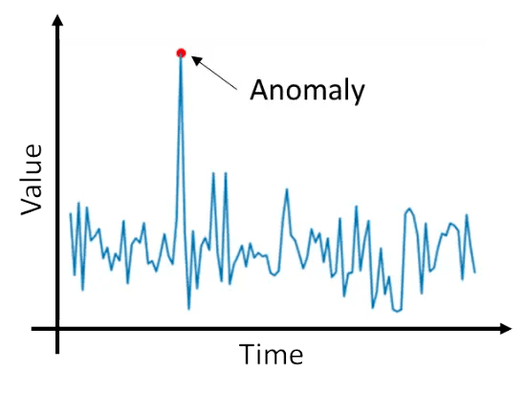

# Machine learning model for network anomaly detection

W dobie powszechnej cyfryzacji, zapewnienie skutecznego cyberbezpieczeństwa stało się jednym z największych wyzwań. Dynamiczny rozwój usług sieciowych generuje ogromne wolumeny danych w czasie rzeczywistym. Tak duża ilość danych wymaga automatycznego systemu do wykrywania anomalii sieciowych którego kluczowym elementem byłby model uczenia maszynowego.

Głównym celem niniejszego projektu jest opracowanie modelu do klasyfikacji binarnej i wieloklasowej. Realizacja zadania opierać się będzie na analizie obszernego zbioru danych, w którym system będzie klasyfikował zdarzenia pod kątem występowania anomalii. W procesie badawczym wykorzystane zostaną zaawansowane metody uczenia maszynowego, ze szczególnym uwzględnieniem różnorodnych technik wykrywania elementów odstających (outlier detection). Podejście to pozwoli na identyfikację nie tylko znanych zagrożeń, ale także nietypowych odchyleń od normy (przedstawionych schematycznie na Rysunku 1), które często towarzyszą nowym, niezidentyfikowanym wcześniej typom cyberataków.

