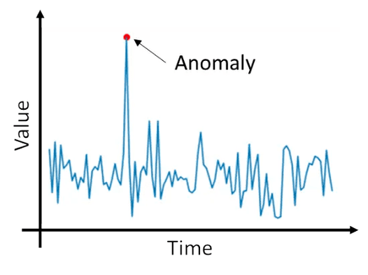
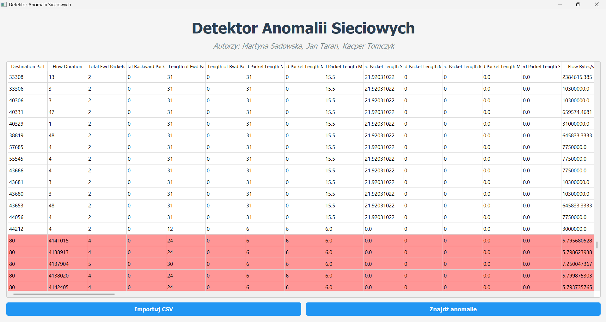

# Machine Learning Model for Network Anomaly Detection

W dobie powszechnej cyfryzacji, zapewnienie skutecznego cyberbezpieczeństwa stało się jednym z największych wyzwań. Dynamiczny rozwój usług sieciowych generuje ogromne wolumeny danych w czasie rzeczywistym. Tak duża ilość danych wymaga automatycznego systemu do wykrywania anomalii sieciowych którego kluczowym elementem byłby model uczenia maszynowego.

Głównym celem niniejszego projektu jest opracowanie modelu do klasyfikacji binarnej i wieloklasowej. Realizacja zadania opierać się będzie na analizie obszernego zbioru danych, w którym system będzie klasyfikował zdarzenia pod kątem występowania anomalii. W procesie badawczym wykorzystane zostaną zaawansowane metody uczenia maszynowego, ze szczególnym uwzględnieniem różnorodnych technik wykrywania elementów odstających (outlier detection). Podejście to pozwoli na identyfikację nie tylko znanych zagrożeń, ale także nietypowych odchyleń od normy (przedstawionych schematycznie na Rysunku 1), które często towarzyszą nowym, niezidentyfikowanym wcześniej typom cyberataków.



## Autorzy

Martyna Sadowska, Jan Taran, Kacper Tomczyk

## Struktura projektu

```
.
├── main.py                  # PyQt5 GUI aplikacja
├── download_data.py         # Skrypt aby pobrać dane z Kaggle
├── projekt.ipynb            # Jupyter notebook z trenowaniem modelu i analizą
├── model_xgboost.json       # Wytrenowany XGBoost model
├── data/                    # Folder ze zbiorem danych (CICIDS 2017 CSV files)
└── requirements.txt         # Python dependencies
```

## Dataset

The project uses the [Network Intrusion Dataset (CICIDS 2017)](https://www.kaggle.com/datasets/chethuhn/network-intrusion-dataset) from Kaggle, which contains network traffic captures from a simulated environment with various attack types including:

- DDoS
- Port Scan
- Web Attacks (SQL Injection, XSS, Brute Force)
- Infiltration
- Normal traffic (benign)

## Requirements

- Python 3.8+
- PyQt5
- pandas
- numpy
- xgboost
- scapy
- kagglehub

Zainstaluj wszystkie biblioteki komendą:

```bash
pip install pyqt5 pandas numpy xgboost scapy kagglehub
```

## Jak włączyć

### 1. Pobierz zbiór danych

```bash
python download_data.py
```

Ta linijka pobiera pliki csv CICIDS 2017 do folderu `data/` używając `kagglehub`.

### 2. (Opcjonalne) Trenowanie / eksploracja modelu

Otwórz i włącz `projekt.ipynb` w Jupyter aby zobaczyć całą analizę danych, inżynierię cech, i trenowanie modelu.

```bash
jupyter notebook projekt.ipynb
```

### 3. Włącz aplikacje

```bash
python main.py
```

Aplikacja domyślnie będzie zmaksymalizowana. Kliknij w przycisk **"Importuj CSV"** aby załadować wybrany zbiór z dostępnych csv'ek. Następnie kliknij **"Znajdź anomalie"** aby zgodnie z nazwą pozwolić modelowi znaleźć ukryte anomalie. Znalezione anomalie zostaną podświetlone na czerwono.


